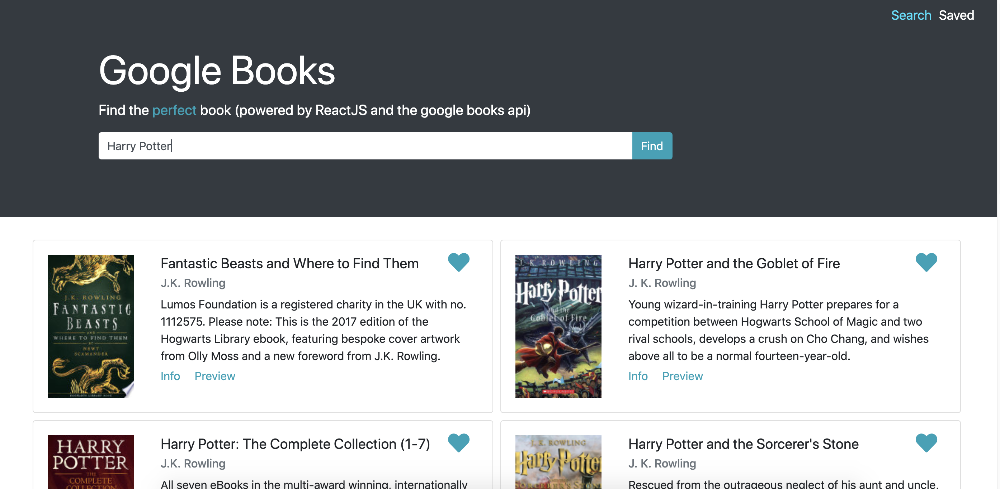
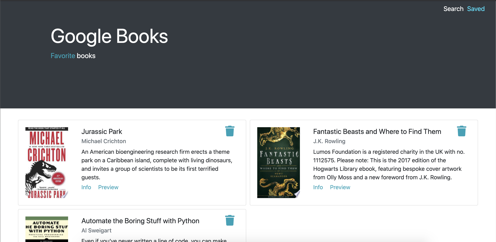

# google-react-books

MERN stack web app which allows users to find and save books using the google books api and MongoDB

Deployed at: https://googlebooks-js.herokuapp.com/

# Search Page

# Favorites Page

## Technologies used

- MongoDB
- Express.js
- React.js
- Node.js
- XML
- JavaScript
- CSS
